:title: Introduction to Assembly
:data-transition-duration: 1500
:css: asm.css

An introduction to x86

----

Basic Operations
================

----

Objectives
==========

* Utilize basic arithmetic and bit operations
* Understand the difference between signed and unsigned values, from an assembly perspective
* Understand the Two's Complement representation of signed numbers
* Understand the Stack as it pertains to assembly programming, and implement functions that utilize it to load and store data

----

Arithmetic Operations
=====================

Basic Math Operations

----

The add and sub instructions
============================

Description
-----------

Adds and subtracts arbitrary values. The destination (where the result is stored) is the first value provided.

Basic Use
---------

Using an immediate, we can just add a number to a value in a register:

.. code:: nasm

	mov rax, 1
	add rax, 2 ; rax now contains 3
	sub rax, 1 ; rax now contains 2

We can also add the values stored in two registers together:

.. code:: nasm

	mov rax, 1
	mov rcx, 2
	add rax, rcx ; as above, rax now contains 3
	sub rax, rcx ; rax is now back to 1

----

The mul instruction
============================

Description
-----------

Allow multiplication of arbitrary values. Takes a single argument, multiplies by rax/eax/ax (depending on operand size).

Basic Use
---------

.. code:: nasm

	mov eax, 10
	mov ecx, 10
	mul ecx 	; rax now contains 100

	mov rax, 5
	mov rcx, 7
	mul rcx     ; rax now contains 35

.. note::

	Results are mostly stored in the source operand (ax/eax/rax), but may be stored in dx/edx/rdx as well if overflow occurs. The table on the next slide illustrates this.

----

The mul instruction: storing results
====================================

Results are stored in the source (possible), or in a combination of registers in the configuration below:

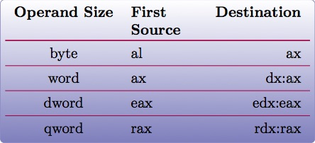

----

The div instruction
===================

Description
-----------

As with mul, div takes a single argument, and divides the value stored in the dividend register(s) by it. This is typically ax/eax/rax (and the \*dx equivalents), but may vary a bit depending on the size (chart provided on the next slide).

Basic Use
---------

.. code:: nasm

	; clearing the high bits, we're only using what's in rax!
	mov rdx, 0 ; there's a better way to do this, but we haven't learned it yet!
	mov rax, 2
	mov rcx, 10
	div rcx    ; rax now contains 5

----

div: operation results
======================

Where to retrieve the results of a div from depends on the size of the arguments. The table below illustrates this relationship:

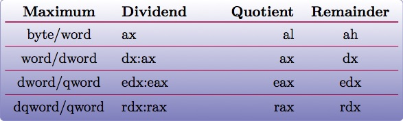

----

inc and dec
===========

Description
-----------

Adds or subtracts one from the provided register, storing the result in place.

Basic Use
---------

.. code:: nasm

	mov rax, 1 	; rax now contains 1
	inc rax		; rax now contains 2
	inc rax		; rax now contains 3
	dec rax		; rax now contains 2

----

Lab 3
=====

Arithmetic Operations

----

:data-rotate: 90

The Stack
=========

* Grows from high memory to low memory
* Current function typically exists within a stack "frame" (but not always!)

----

:data-x: r0
:data-y: r2000
:data-rotate-y: 0

Stack Frames
============

* RSP (or ESP) points to the top of the stack
* RBP (or EBP) points to the "base" of the stack frame

----

Stack Frame Layout
==================

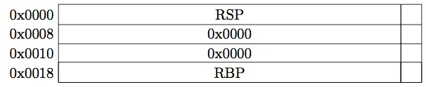

----

Expanding the Stack Frame
=========================

* Can modify the value of RSP directly to allocate more stack space:

.. code:: nasm

	sub rsp, 16

* But you must always ensure you clean up before the function returns:

.. code:: nasm

	add rsp, 16

----

Stack Alignment
===============

* x86_64 expects 16 byte stack alignment
* Allocating odd amounts of space can cause things to break
* ALWAYS make sure you clean up your stack before returning

----

GDB - Stack Frames
==================

* Examining the Call Stack (backtrace / bt)
* Frames and information
	+ frame || f - Get information about the current frame
	+ info args - Get information about function arguments
	+ info locals - Information about local variables

.. note::

	May be appropriate to demo GDB and stack frames

----

New Instructions: push and pop
==============================

Description
-----------

Push will subtract a pointer-width amount of space from RSP, and place the argument in the newly-allocated location.
Pop performs the opposite action, storing the value just below RSP in the register provided, and adding a pointer-width amount to RSP.
For every push, you will need to pop!

Basic Use
---------

.. code:: nasm

	mov rax, 1		; 1 is now stored in rax.
	push rax		; 1 is now stored at the top of the stack
	pop rcx			; rcx now contains 1

----

Growing the Stack
=================

After a push operation:

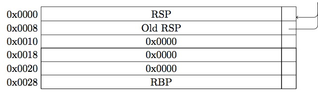

----

:data-x: r0
:data-y: r0
:data-rotate-y: 90

Restoring the Stack
===================

After a pop operation:

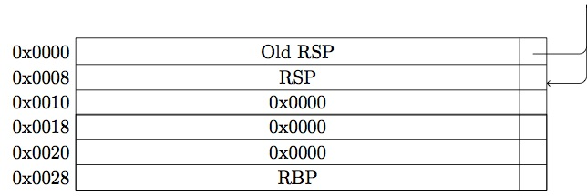

----

:data-y: r2000

Lab 4
=====

Stack Operations

----

:data-rotate-y: 0
:data-y: r100
:data-x: r-1000

Negative Numbers
================

Two's Complement
----------------

* Negative numbers on the x86(_64) platform are represented via Two's Complement

.. note::

	On understanding Two's Complement: think of what happens when a mechanical counter (like the one pictured on the slide) counts down to zero,
	and rolls over. You might see it flip all the numbers over: e.g., 9999

----

:data-rotate-z: 0
:data-y: r100

Two's Complement
================

* Invert the bits of the number (in binary), and add one!

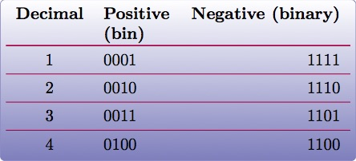

----

:data-x: r2000

Sub Registers and Sign extending
================================

* When copying smaller data into a register, sign extending may be used (rather than zero extending)
* Sign extending preserves the "signed" attributes of the data being copied.
* The movsx instruction (just like movzx) handles this.

----

The movsx Instruction
=====================

Description
-----------

Much like movzx, movsx can be used to move data into a portion of a larger register, while preserving its sign.

Basic Use
---------

.. code:: nasm

	mov cl, -1
	movsx rax, cl 	; rax now contains -1.

----

:data-y: 0

Bitwise Operations
==================

----

Bit shifting
============

* Two unsigned shift operations exist: shl (shift left) and shr (shift right)
* Shifting moves the bits in the register over the direction (left or right) and number of bits specified
* Bits that fall off the end (and overflow) will disappear, except for the last one, which ends up in the 
  carry flag (which we'll discuss later)
* The extra space created gets padded with 0's

----

Left Shift Diagram
==================

The following snippet of assembly:

.. code:: nasm

	mov rax, 1
	shl rax, 1
	shl rax, 3

Can be modelled by the following table:

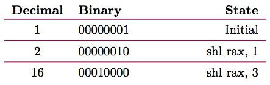

----

Right Shift Diagram
===================

Similarly, the following snippet of assembly:

.. code:: nasm
	
	mov rax, 32
	shr rax, 1
	shr rax, 4

Can be modelled by the following table:

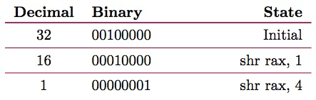

----

Binary and/or
=============

* and can be used to determine whether or not one or more bits are set in
* or will tell you if the bit is set in at least one place
* Both take two operands, one of which will hold the result after the operation completes

Use:
----

.. code:: nasm

	mov rax, 1		; rax contains 00000001
	mov rcx, 5		; rcx contains 00000101
	
	and rax, rcx	; rax contains 00000001
	or rax, rcx		; rax contains 00000101

.. note::

	Another way to think about this (if familiar with sets and set theory): AND gives us the intersection between the two sets of bits, OR gives us their union.

----

And Table
=========

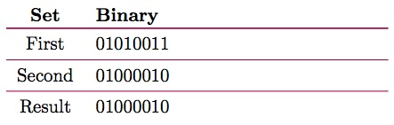

----

Or Table
========

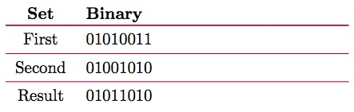

----

Binary not
==========

* Inverts the bits in a given register

Example:

.. code:: nasm

	mov rax, 0		; rax now contains 00000000
	not rax			; rax is now all 1's (or 0xffffffff)

Similarly:

.. code:: nasm

	mov rcx, 1		; rcx now contains 1
	not rcx			; rcx now contains: 
				; 0xfffffffe (all 1's except for the first bit) 

----

Properties of eXclusive Or
==========================

* XOR yields 1 only if the bit is set in either the source or destination, but NOT both
* Any value XOR'd with itself is 0.
* 0 XOR'd with any value is that value
* For numbers A, B, and C, if A ^ B = C, then C ^ A = B 
  and C ^ B = A.

----

XOR table
=========

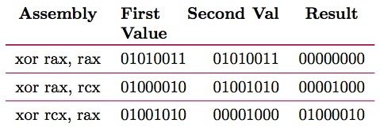

----

Rotating Bits
=============

* The values in the register are rotated the indicated number of places to the right or left
* Bits that are rotated off the end of the register and moved back to the beginning

Instruction:

.. code:: nasm

	mov rax, 1	; rax contains 1 (00000001)
	rol rax, 1  ; rax now contains 2 (00000010)
	ror rax, 1 	; rax now contains 1 (00000001)
	ror rax, 1	; rax now looks like: (10000000)

----

Signed Bit Operations
=====================

* Shift operations that are sign aware exist (SAR for right and SAL for left)
* Work in the same fashion as shr/shl, except for how bits shifted off the end are treated (bits still disappear, but the sign of the resulting value is retained)

----

Lab 5
=====

Bit operations
