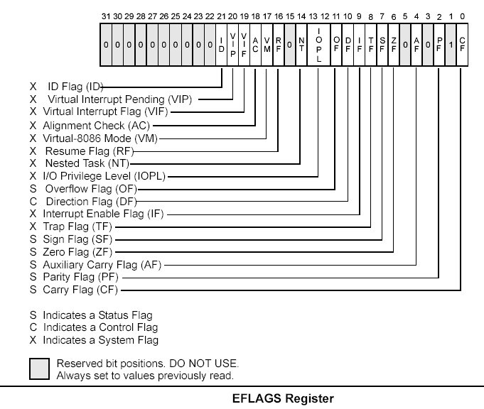
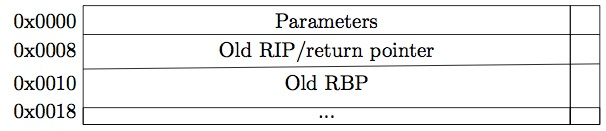
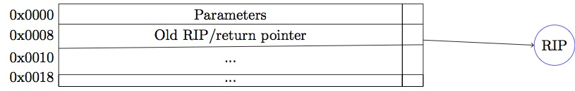

:title: Introduction to Assembly
:data-transition-duration: 1500
:css: asm.css

An introduction to x86 and x86_64

----

Control Flow
============

----

Objectives
==========

* Understand and utilize status flags and conditional control flow
* Understand and utilize x86(_64) string instructions and corresponding instruction prefixes
* Understand and implement methods utilizing a variety of calling conventions (both x86 and x86_64)

----

:class: split-table

FLAGS
=====

* A register that contains a variety of bits representing state and status information
* Varies in size, but many portions (in newer processors) aren't used

+--------+-----------+
| FLAGS  |  16 bits  |
+--------+-----------+
| EFLAGS |  32 bits  |
+--------+-----------+
| RFLAGS |  64 bits  |
+--------+-----------+

----

Flag Layout
===========

Credit: the Intel Manual

----

Flags we care about now
=======================

* Zero Flag (ZF) - set when an operation that sets the zero flag produces a zero - includes arithmetic and bitshift operations
* Carry Flag (CF) - set when an arithmetic borrow or carry occurs during add/sub - e.g., the result of an add would have set bit 33 (in x86), or bit 65 (in x86_64)
	+ also set with some bitshift operations (such as when a bit falls off the end in a shl/shr)

----

Flags we care about now (cont'd)
================================

* Overflow Flag (OF) - Indicates that sign bit of the result of an operation is different than the sign bits of the operands
	+ Ex.: Adding two large position numbers ends up producing a negative result (due to overflow)
* Sign Flag (SF) - Set to indicate the result of an operation is negative

----

Accessing the Flags
===================

* Can be set and checked manually
	+ Some have special instructions for set and clear (which we'll talk about later)
	+ Flag register can be accessed and set via pushf(d|q)/popf(d|q)

----

pushf and popf
==============

Description
-----------

Pushes the flags register (or the first 16 bits... eflags (32 bits) or rflags (64 bits) if pushfd or pushfq) onto the stack, and pops the value on top of the stack into the flags register (or eflags/rflags)

Basic Use
---------

.. code:: nasm

	pushf 	; flags have been pushed to the stack
	; ... do stuff
	popf	; flags have been restored!

----

Lab 6
=====

Flag manipulation...

* Copy the Lab6 folder (and its contents)
* Modify the \*.nasm file (Each function should have a comment block - lines starting with ';' containing instructions)
* Build and run using the following commands:

.. code:: bash

    ~/Desktop/Lab6 $ cmake . && cmake --build .
    ~/Desktop/Lab6 $ ./lab6

----

:data-x: r2500
:data-y: r0
:data-rotate-z: 90

Control Flow
============

----

:data-x: r0
:data-y: r2000

Line Labels
===========

* Global and local

.. code:: nasm

	global_label:
		; stuff

	.local_label:
		; more stuff

----

Everybody jmp .around
=====================

* jmp provides an unconditional branch, or transfer of execution to the target

.. code:: nasm
   
    .label1:
        xor rax, rax
        inc rax
        mov rcx, rax
        jmp .label2
        mov rsp, rax   ; never gets executed
    .label2:
        shl rcx, 3  ; execution continues here...
        xchg rcx, rax
        ret

----

call and ret
============

* Similar to jmp, but with a few key differences
* Functionally equivalent to: push rip followed by a jmp X
* Typically indicates a function call

.. code:: nasm
    
    mov rax, 1
    call label1 ; push RIP, jump to label1
    jmp label2 
    label1:
        ror rax, 1
        ret     ; returns control returns to "jmp label2"
    label2:
        ; ...

----

More on ret
===========

* Pops the return pointer off the stack and jumps to it
* Used to return to the last point of execution (as shown on the previous slide)

The stack, during function execution:

----

Once we get to the end, and we're ready to return:

.. code:: nasm

    ; ...
    pop rbp
    ret

Our stack frame does something like this:

popping off the old RBP, then popping the return pointer, and jumping to it (effectively "pop rip")

----

A Side Note About Functions
===========================

* Typically store the stack pointer ((E|R)SP) at the top of the function
* If stored, must be (re)stored before returning
    + If we don't, our stack location will be off
    + If left at the top of the stack, we will return ONTO the stack!
* This is not always done, as in FPO (Frame Pointer Optimization/Omission)
* Functions will be covered in more depth later

.. code:: nasm

    myfunc:
        mov rbp, rsp
        push rbp
        ; ...
        pop rbp
        ret

----

:data-x: r0
:data-y: r1000
:data-rotate-z: 180

Conditional Control Flow: Comparisons
=====================================

----

:data-x: r-2500
:data-y: r0
:data-z: r0

cmp
===

* Compares two values by subtraction (e.g., SUB op1, op2)
* Sets flags to indicate whether the values were equal, or if one was larger
* Flags set by this instruction: CF, OF, SF, ZF, AF, and PF

Example:

.. code:: nasm

    xor rax, rax
    cmp rax, 0  ; they're equal! the ZF is now set

----

test
====

* Compares two values by doing a bitwise AND
* The SF, PF, and ZF get set by this operation
* Often used to test whether or not a register is 0

Example:

.. code:: nasm

    mov rax, 1
    test rax, rax ; the ZF is set to 0, as the result isn't 0

    ; ...

    xor rax, rax
    test rax, rax ; the ZF is now 1

----

Jcc
===

* A large set of conditional branch instructions 
* Most execute based on the value of one or more flags
* Some common conditional jumps:
    + je or jz - Jump if Equal (or Jump if Zero)
    + jne/jnz - Jump if Not Equal (or Not Zero)
    + ja - Jump if Above (if the operand compared previously is greater)
    + jb/jc - Jump if Below (or Jump if Carry) 
* Many others - Refer to the intel manual for a comprehensive list

.. note::

    A large number of the Jcc instructions actually evaluate to the same thing (e.g., JE vs JZ)

----

Jcc Cont'd
==========

A simple check to see if the result of an operation is 0:

.. code:: nasm

    xor rax, rax
    test rax, rax
    ; Because the zero flag is set here, we jump to the end
    jz .end       
    mov rsi, rax  ; not executed
    ; ...
    .end:
    ret

----

Jcc Cont'd
==========

A simple loop:

.. code:: nasm

    mov rcx, 10    ; set our loop count to 10
    xor rax, rax   ; set rax to 0
    ; This evaluates to: 10 + 9 + 8 + ... + 1 + 0
    .continue:
        add rax, rcx  ; add the current value of rcx to rax
        dec rcx       ; subtract 1 from rcx
        test rcx, rcx ; check to see if rcx is 0
        jnz .continue ; jump back to .continue, if rcx isn't 0

    ret

----

loop
====

* A simple macro for dec rcx/test rcx,rcx/jnz <target>
* Expects ECX/RCX to be populated with a counter variable

The loop from the previous slide could be re-written

.. code:: nasm

    mov rcx, 10
    xor rax, rax
    .continue:
        add rax, rcx
        loop .continue
    ret    

----

Lab 7
=====

Execution control flow...

* Copy the Lab7 folder (and its contents)
* Modify the \*.nasm file (Each function should have a comment block - lines starting with ';' containing instructions)
* Build and run using the following commands:

.. code:: bash

    ~/Desktop/Lab7 $ cmake . && cmake --build .
    ~/Desktop/Lab7 $ ./lab7

----

:data-x: r0
:data-y: r0
:data-rotate-x: 90

String Instructions
===================

* What a "string" means to x86(_64)
    + Really just a string of bytes
    + No particular qualms about terminators (e.g., '\0')
* Several prefixes and a flag that will modify behavior (more on those later)
* All of them have the unit to move/copy/initialize/scan appended to the end (e.g., scasb vs scasw vs scasd, etc)

----

:data-x: r0
:data-z: r2500

String Instructions - Cont'd
============================

* Common features:
    + RSI (or ESI, in x86) is treated as a pointer to the beginning of the "source"
    + RDI (or EDI, in x86) is treated as a pointer to the beginning of the "destination"
    + RCX (or ECX, in x86) is assumed to hold the count, if needed
    + RAX (or EAX, in x86) is assumed to hold the value to evaluate, if needed (e.g., store, compare against, etc)
    + Typically increments source and/or destination register pointers by the amount of data operated on (e.g., movsb would add 1 to both RSI and RDI, where movsd would add 4)

----

Some Common Instructions
========================

* Scan String - scas(b/w/d/q) - Scans a string located as RDI for the value found in RAX/EAX/AX/AL (depending on size used), and increments the pointer
* Store String - stos(b/w/d/q) - Initializes the string located at RDI to the value pointer at by RAX/EAX/AX/AL (depending on size used) and increments the pointer
* Load String - lods(b/w/d/q) - Copies the value from RSI into RAX/EAX/AX/AL, and increments the pointer
* Move String - movs(b/w/d/q) - Copies data from RSI into RDI, and increments both pointers.
* Compare String - cmps(b/w/d/q) - Compares the values stored at RSI and RDI, and increments the pointer, updating the RFLAGS (or EFLAGS) register with the result.

----

Prefixes
========

* Several instruction prefixes available to modify behavior - looping the instruction over a section of memory
* All of them tend to use RCX/ECX/etc as a termination condition - decrementing each execution
* Some prefixes available:
    + REP - continue performing the action RCX times.
    + REPNE - continue performing the action RCX times, or until the FLAGS register indicates the operands were equal.
    + REPE - Continue perform the action RCX times, or until the FLAGS register indicates the operands were not equal.
* Often used by compilers to essentially inline C string functions (such as strlen, memset, memcpy, etc)

----

Prefix Examples
===============

* Unconditional:

.. code:: nasm

    xor rax, rax    ; rax is now 0
    mov rcx, 20     ; rcx now contains 20
    mov rdi, _my_string_buf
    rep stosb       ; Continue to store 0 till rcx
                    ; is 0

* Conditional:

.. code:: nasm

    xor rax, rax
    mov rcx, 20
    ; assume the buffer below contains a string
    mov rdi, _my_populated_buf
    repne scasb     ; continue until we hit a NULL byte
    ; RCX now contains 20 - <the number of bytes we checked>
    ; ...

----

The Direction Flag
==================

* Controls the direction buffers are traversed when using the REP* prefixes
* If set during execution/an operation, ALWAYS clear after (or crashes will likely occur)

.. code:: nasm

    std     ; the direction flag has been set
    ; do stuff here
    cld     ; clear the direction flag, continue operations

----

Lab 8
=====

String Operations

* Copy the Lab8 folder (and its contents)
* Modify the \*.nasm file (Each function should have a comment block - lines starting with ';' containing instructions)
* Build and run using the following commands:

.. code:: bash

    ~/Desktop/Lab8 $ cmake . && cmake --build .
    ~/Desktop/Lab8 $ ./lab8

----

:data-x: r0
:data-y: r0
:data-z: r0
:data-rotate-y: 90

Functions
=========

----

:data-x: r0
:data-y: r-2500
:data-z: r0

Calling Conventions: x86
========================

* Microsoft - many calling conventions exist for x86
    + Different implications for how arguments get passed
    + Different implications for stack cleanup after function returns
    + Name mangling is often used to differentiate

* System V x86 Calling Convention
    + Most POSIX-compliant (and POSIX-like) platforms abide by this
        - Such as Linux, Solaris, BSD, OSX, etc
        - Also called cdecl

* Other Calling Conventions

.. note::
   
    Many others exist (such as safecall or pascal) on Windows alone
    Only a few will be covered here (outside of passing mention)

----

Microsoft Conventions: stdcall
==============================

* Indicated to compiler (from C) by __stdcall prefix
* Arguments pushed on the stack (in order from right to left)
* The function being called (the "callee") cleans up the space allocated
* Name gets decorated with an appended "@X", where X is the number of bytes to allocate (num args * 4)

----

stdcall - cont'd
================

Standard call in action - Stack Cleanup:

.. code:: nasm

    ; Equiv: void __stdcall myfunc(int a, int b);
    _myfunc@8:
        ; do stuff
        ret 8   ; we've cleaned up 8 bytes

Optionally, we can clean up like this:

.. code:: nasm

    _myfunc@4:
        ; do stuff
        add esp, 4
        ret

----

stdcall - cont'd
================

Standard call in action - Accessing Parameters:

* If EBP hasn't been pushed to the stack:

.. code:: nasm

    _myfunc@8:
        mov eax, [esp + 4] ; parameter 1-above the return pointer
        mov ecx, [esp + 8] ; parameter 2-above param 1
        ; do stuff
        ret 8

* Otherwise:

.. code:: nasm

    _myfunc@8:
        push ebp
        mov ebp, esp
        mov eax, [ebp + 8]  ; above both the ret ptr and old ebp
        mov ecx, [ebp + 12]
        pop ebp
        ret 8

----

Microsoft Conventions: cdecl
============================

* This is also the System V calling convention (e.g., what most non-microsoft platforms use)
* Paramters passed in the same fashion as in stdcall
* Stack cleanup is different, the calling function (e.g., caller) is responsible for cleanup
* No real name mangling, aside from a leading underscore "_"

----

cdecl - cont'd
==============

Cdecl in action: Stack cleanup

.. code:: nasm

    ; callee
    _myfunc:
        push ebp
        mov ebp, esp
        ; do stuff
        pop ebp
        ret

    _caller:
        ; ...
        push 2  ; arg 2
        push 1  ; arg 1
        call _myfunc
        add esp, 8  ; clean up
        ; ...  

----

Microsft Conventions: fastcall
==============================

* First two arguments (from left to right) passed via registers (ECX and EDX)
* Remaining arguments pushed on the stack (right to left, as with cdecl and stdcall)
* Cleanup is performed by callee (as with stdcall)
* Name mangling is similar to stdcall, but an additional "@" is prepended (e.g., "_@myfunc@8")

----

Conventions: thiscall
=====================

* "Special" convention used for C++ non-static member functions
* Defines a method of passing the "this" pointer (which allows those functions access to a specific instance of a class)
* Slightly different between Microsoft and System V
* Microsoft: The "this" pointer is passed in ECX, other parameters work like stdcall
* System V: Works like cdecl, but the "this" pointer is the first argument to the function
* C++ name mangling is a more complex topic (and somewhat compiler dependent)

----

x64 Calling Conventions
=======================

* Only one convention for each (Mostly... there are still some oddballs like vectorcall, but we aren't going to dive into those)
* thiscall on x64 (both conventions) passes the "this" pointer as an implicit first argument (as it does for System V x86)
* Both conventions work similarly to __fastcall, passing arguments in registers (though the registers differ between platforms)

----

Microsoft x64 Calling Convention
================================

* Uses 4 registers to pass the first 4 parameters (RCX, RDX, R8, and R9)
* Floating point values are passed via SIMD registers (XMM0-3... we'll talk more about this later)
* Remaining values are added to the stack
* Caller's responsibility to clean up (as with __cdecl)

----

Shadow Space
============

* x64 Calling Conventions require stack allocation for passed variables
* Intent is to allow function being called to immediately spill registers (if desired)
* Windows ABI requires space to be allocated for 4 registers (regardless of function parameter count)
* Additional arguments (beyond 4) are added via the stack 
    + BUT in the location they would normally occur at if all parameters were passed that way 
    + Example: param 5 would begin at [rsp + 0x20]

----

Microsoft x64 Calling Convention
================================

No parameters:

.. code:: nasm

    callee:
        ; ...
        ret

    caller:
        sub rsp, 0x20   ; 8 * 4 - for register spillage
        call callee
        add rsp, 0x20   ; cleanup

----

Microsoft x64 Calling Convention
================================

5 Or More Parameters

.. code:: nasm

    sub rsp, 0x28           ; space to store 5 params
    mov rcx, 0x41           ; param 1 = A
    mov rdx, 0x42           ; param 2 = B
    mov r8, 0x43            ; param 3 = C
    mov r9, 0x44            ; param 4 = D
    mov [rsp + 0x20], 0x45  ; param 5 = E
    call myfunc
    add rsp, 0x28           ; cleanup

----

Microsoft x64 Calling Convention
================================

Some additional reading on Microsoft's x64 calling convention:

* https://blogs.msdn.microsoft.com/oldnewthing/20040114-00/?p=41053/

----

System V x64 Calling Convention
===============================

* Similar to the Microsoft calling convention, but more values are passed via registers
* The first 6 arguments are passed via register (RDI, RSI, RCX, RDX, R8, and R9)
* Floating point arguments go in SIMD registers (XMM0-7)
* Additional arguments are pushed onto the stack
* Shadow space is not required, but stack must remain 16-byte aligned
* Red zone optimization provides free stack space for leaf functions

----

Red Zone
========

* Allows use of the next 128 bytes below RSP without modifying stack pointer
* Further function calls WILL clobber space
    + Because of this, Red Zone use is most suitable for leaf functions
    + Safe from interrupt handlers, etc.

----

System V x64 Example
====================

Calling strlen

.. code:: nasm

    extern strlen
    
    ; ensure NULL termination!
    mystring db "this is a string", 0x00 

    call_strlen:
        mov rdi, mystring
        call strlen
        ret

----

Return Values
=============

Typically, the value returned at the end of the function call will be stored in RAX (for x64), or EAX (for x86)

----

Register Preservation - x86
===========================

* Volatile: EAX, ECX, and EDX don't need to be saved during a function call
* All others must be preserved.

----

Register Preservation - x64
===========================

* Windows: Volatile Registers (don't need to be preserved by callee) 
    + RAX, RCX, RDX, R8, R9, R10, and R11
    + XMM0-3 and 5
    + All others need to be preserved

* System V
    + Most registers are volatile (need to be preserved by caller if the values are to be retained)
    + Exception: RBP, RBX, and R12-15 are non-volatile (must be preserved)

----

Additional Links
================

More information on both x64 calling conventions:

* http://eli.thegreenplace.net/2011/09/06/stack-frame-layout-on-x86-64/

----

Lab 9
=====

Functions

* Copy the Lab9 folder (and its contents)
* Modify the \*.nasm file (Each function should have a comment block - lines starting with ';' containing instructions)
* Build and run using the following commands:

.. code:: bash

    ~/Desktop/Lab9 $ cmake . && cmake --build .
    ~/Desktop/Lab9 $ ./lab9

----

Windows Functions Lab
=====================

Functions - Calling Conventions (x86)

* Copy the WinFunctions folder to your Windows system
* Copy the nasm binary to WinFunctions\\ASM\\nasm.exe
* Edit WinLab.nasm under WinFunctions\\ASM\\ASM\\WinLab.nasm
* build via VS2015 (as normal), or via msbuild using the following command:

.. code:: 

    C:\..\WinFunctions\ASM> "%VS140COMNTOOLS%vsvars32.bat" 
    C:\..\WinFunctions\ASM> msbuild ASM.sln

----

Section Review
==============

* Flags
* Jumps
* Call and ret
* string instructions
    + prefix
* Functions and calling conventions
