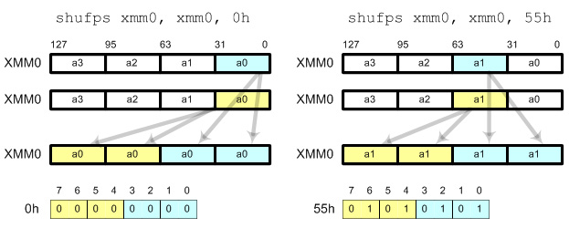

:title: Introduction to Assembly
:data-transition-duration: 1500
:css: asm.css

An introduction to x86 and x86_64

----

Floating Point and SIMD
=======================

----

Objectives
==========

* Understand at a basic level how floating point numbers are represented
* Perform basic floating point operations
* Understand and utilize the Single Instruction Multiple Data hardware to perform basic operations

----

x87 - The Floating Point Architecture
=====================================

.. image:: ./images/fpu_outline.jpg

----

==============
Data Registers
==============

* Can contain any 32 or 64 bit data
* Can't transfer directly from standard registers (e.g., EAX/RAX)

.. image:: ./images/fpu_data_regs.jpg

----

GDB
===

Display floating point registers:

.. code:: bash

	(gdb) tui reg float 

----

Floating Point Exceptions
=========================

* Floating point exceptions are separate from typical interrupts
* They are the only interrupts you can disable from an unprivileged operating context
* The previous instruction pointer (and other contextual information) are stored via special registers

----

Floating Point - Additional Information
=======================================

* Floating point hardware also includes its own FLAGS register
* As mentioned in the previous slide, contextual information is stored in special registers under certain circumstances

.. image:: ./images/fpu_outline.jpg

----

Floating Point Encoding
=======================

* Data encoding is a great deal more complicated for floating point than other types
* Floating point numbers are represented via scientific notation (sort of)
* We can store floats in one of three ways:
	+ Single Precision -> which is 32 bits
	+ Double Precision -> which is 64 bits
	+ Quad Precision -> which is 128 bits

----

Floating Point Encoding (cont'd)
================================

Four parts to the equation:

	+ Significand (also called the mantissa) - This is the decimal representation of our number. A non-zero value will always be in the left-most position
	+ Radix - The base to multiply by (e.g., 10)
	+ Exponent - The power to raise the radix to

----

Floating Point Data Encoding
============================

* x87 Registers Show the split between different parts (under the hood)

So if we have a number like 1378.5, and our hardware looks like this:

.. image:: ./images/fpu_data_regs.jpg

We have:

.. image:: ./images/fpu_equation.png

----

Binary Representation
=====================

1. We take the base 2 representation of the number
2. We transform the number, such that it can be represented via scientific notation
3. The exponent is encoded using a "biased" value, which expedites compare operations
4. Since we know that the left-most position of the significand will always be 1, it is dropped for single precision numbers (though it is preserved in doubles).

----

Exponent Values
===============

Bias value added to exponent

.. image:: ./images/fpu_biased_table.jpg

e.g., an exponent of 3 (111 in binary) would get added with 127 (in the case of a single precision float), or 1111111, to get 10000110.

----

Special Exponent Values
=======================

* Some values are preserved for special cases in exponent representation
	+ 00000000 (all 0s) - This value is used to encode +/- infinity
	+ 11111111 (all 1s) - This value is used to indicate NaN (Not a Number)

* NaN simply indicates that the floating point encoded value is not valid.

----

Working with Floating Point 
===========================

* The floating point registers are treated like a stack
* Values get pushed on (via "load" instructions) and popped off/copied (via "store" instructions)

----

FPU Instruction Set
===================

Basic Operations

* Loads (push)
	+ fld - Loads a floating point value from the indicated location, onto the stack
	+ flid - Loads an integer value, encoding it as a double, onto the stack

* Stores
	+ fst - Stores the value on the top of the stack at the specified location (either memory or elsewhere in the floating point stack)
	+ fstp - Performs the same operation as above, but also pops the value off the stack.
	+ fist - Converts the value at the top of the stack to an integer, and stores it at the destination.

*  Exchange: fxch - Swaps the contents of the given floating point registers

----

FPU Conditional Move
====================

fcmovcc - Move if: Copies the contents from the requested register in the stack to the top if the condition is satisfied 

* b (e.g., fcmovb) - Move if below (if CF is set to 1)
* nb - Move if not below (e.g., CF is 0)
* e - Move if equal (e.g., ZF is 1)
* ne - Move if not equal (ZF is 0)
* be - Move if below or equal (CF is 1 or ZF is 1)
* nbe - Move if not below or equal (CF is 0 and ZF is 0)

----

FPU Arithmetic Operations
=========================

* fadd/fsub/fmul - Performs the requested operation on the source and destination operands, storing the results in the destination
* fiadd/fisub/fimul - Similar to above, but performs the requested operation on a floating point and integer value

----

Lab 11
======

Floating Point Operations 

* Copy the Lab11 folder (and its contents)
* Modify the \*.nasm file (Each function should have a comment block - lines starting with ';' containing instructions)
* Build and run using the following commands:

.. code:: bash

    ~/Desktop/Lab11 $ cmake . && cmake --build .
    ~/Desktop/Lab11 $ ./lab11

----

Single Instruction, Multiple Data (SIMD)
========================================

----

What is SIMD?
=============

* Set of specialized hardware and instructions
* SSE (Streaming SIMD Extensions) is part of this (among others)
* Provide a mechanism for operating on "vectors" of data at a time
* Provides a set of 128-bit registers
* Each can be packed with 4 32-bit "scalar" values

----

SIMD Hardware
=============

* x86: 8 SSE registers available, from XMM0 - XMM7
* x64: provides 16 SSE registers, from XMM0 - XMM15

----

Why is SIMD Useful?
===================

* Converts a set of operations (ex: 4 multiplications) in a single instruction

Example: Multiplying two vectors of values - 

.. image:: ./images/simd_ex.bmp

image credit: http://neilkemp.us/src/sse_tutorial/sse_tutorial.html

----

SIMD Data Movement - Aligned vs Unaligned
=========================================

* Some SIMD instructions differentiate between aligned and unaligned data
* In order to use "aligned" instructions, must guarantee 16 byte alignment
* 16 byte is important in this case, because SIMD registers are 16 bytes (128 bits) wide

----

SIMD Operations - Moving Data
=============================

* Operations typically operate on vector or scalar values
	+ Scalar - 32 bits (single element)
	+ Vector - All elements of the SIMD register (128 bits)

* Moving data in/out:
	+ movups - Move 128 bits of data between memory and/or SIMD register(s), unaligned
	+ movaps - Move 128 bits of data between memory and/or SIMD register(s), aligned
	+ movhps - Move 64 bits into the high part of a SIMD register
	+ movlps - Move 64 bits into the low part of a SIMD register
	+ movss - Move a 32 bit value between memory and/or SIMD register(s)

----

SIMD: Moving Around
===================

.. code:: nasm

	movups xmm0, [rdi]	; moving 128 bits of data into xmm0
	movss xmm1, [rsi]	; moving 32 bits of data into xmm1
	mov [rdx], eax 
	movss xmm2, [rdx]

----

:class: instruction-table

SIMD Arithmetic
===============

The table below lists arithmetic instructions, both the scalar and vector variations:

+-----------+-----------+-----------------------+
| Vector    | Scalar    | Description           |
+-----------+-----------+-----------------------+
| addps     | addss     | Adds operands         |
+-----------+-----------+-----------------------+
| subps     | subss     | Subtracts operands    |
+-----------+-----------+-----------------------+
| mulps     | mulss     | Multiplies operands   |
+-----------+-----------+-----------------------+
| divps     | divss     | Divides operands      |
+-----------+-----------+-----------------------+
 
----

SIMD Arithmetic
===============

Example use:

.. code:: nasm

	movups xmm0, [rdi]	; load first vector
	movups xmm1, [rsi]	; load second vector
	addps xmm0, xmm1 	; add the two
	movups [rdx], xmm0	; store the result

----

SIMD Comparisons
================

Comparison Operations

* cmp\* operation is a bit strange at first
	+ Compares a combination of registers/memory
	+ Stores the result in the first operand
	+ Third param indicates the type of compare to do (next slide)
	+ Result stored as 0 if the condition is false, -1 (all 1's) if true
* Min and max preserve the values that are greater (or smaller) between operands

----

:class: instruction-table

SIMD Comparisons
================

Cmp's third parameter:

+----------+------------------+----------+
| Number   | Operation        | C Equiv  |
+----------+------------------+----------+
| 0        | Equal            | ==       |
+----------+------------------+----------+
| 1        | Less Than        | <        |
+----------+------------------+----------+
| 2        | Less or equal    | <=       |
+----------+------------------+----------+
| 3        | Unordered        | n/a      |
+----------+------------------+----------+
| 4        | Not Equal        | !=       |
+----------+------------------+----------+
| 5        | Not Less than    | !(x < y) |
+----------+------------------+----------+
| 6        | Not less or equal| !(x <= y)|
+----------+------------------+----------+
| 7        | Ordered          | n/a      |
+----------+------------------+----------+

----

:class: instruction-table

SIMD Comparisons
================

Operations

+-----------+-----------+-------------------------------+
| Vector    | Scalar    | Description                   |
+-----------+-----------+-------------------------------+
| maxps     | maxss     | Obtains maximum of operands   |
+-----------+-----------+-------------------------------+
| minps     | minss     | Obtains minimum of operands   |
+-----------+-----------+-------------------------------+
| cmpps     | cmpss     | Compares operands, all 1's or |
|           |           | 0's returned.                 |
+-----------+-----------+-------------------------------+

----

SIMD Comparisons
================

Example:

.. code:: nasm

	movups xmm0, [rax]
	movups xmm1, [rcx]
	cmpps xmm0, xmm1, 4	; find the values that are not equal

----

:class: instruction-table

SIMD Bitwise Operations
=======================

+-----------+---------------------------+
| Vector    | Description               |
+-----------+---------------------------+
| andps     | Bitwise and of operands   |
+-----------+---------------------------+
| orps      | Bitwise or of operands    |
+-----------+---------------------------+
| xorps     | Bitwise xor of operands   |
+-----------+---------------------------+

----

Shuffling Data
==============

* Allows us to rearrange the scalar values within the vector
* Takes three arguments:
	+ Source Register
	+ Destination Register
	+ A single immediate byte value (imm8) to control how the shuffle takes place
* Will often be used with the same register as source/destination (to reorder)

.. code:: nasm

	shufps xmm0, xmm0, 0x10

----

Shuffling Data (cont'd)
=======================

* The single byte immediate is broken into 4, 2-bit blocks representing scalar0 - 3
* Each set of bits controls what block from the "source" register gets stored in the "destination"

----

Control Bits
============

* Bits 1-2: Indicate which "source" block will replace the value in block (or scalar) 0 of the destination register (e.g., 01 would cause the contents of block 1 to be stored in block 0)
* Bits 2-3: Indicate which "source" block will be written to block 1 of the "destination"
* Bits 4-5: Indicate which "source" block will replace the contents of block 2 in the "destination"
* Bits 6-7: Indicate which "source" block will replace the contents of block 3 in the "destination"

----

Shuffle - Example
=================

Image credit: http://www.tommesani.com/index.php/component/content/article/2-simd/62-sse-shuffle.html

----

GDB
===

Display SIMD registers:

.. code:: bash

	(gdb) tui reg vector 

----

Lab 12
======

SIMD

* Copy the Lab12 folder (and its contents)
* Modify the \*.nasm file (Each function should have a comment block - lines starting with ';' containing instructions)
* Build and run using the following commands:

.. code:: bash

    ~/Desktop/Lab12 $ cmake . && cmake --build .
    ~/Desktop/Lab12 $ ./lab12

----

Section Review
==============

* Floating Point Architecture
	+ Interrupts
	+ Register Stack
	+ Flags
* SIMD
	+ Registers
	+ Vectors vs Scalars