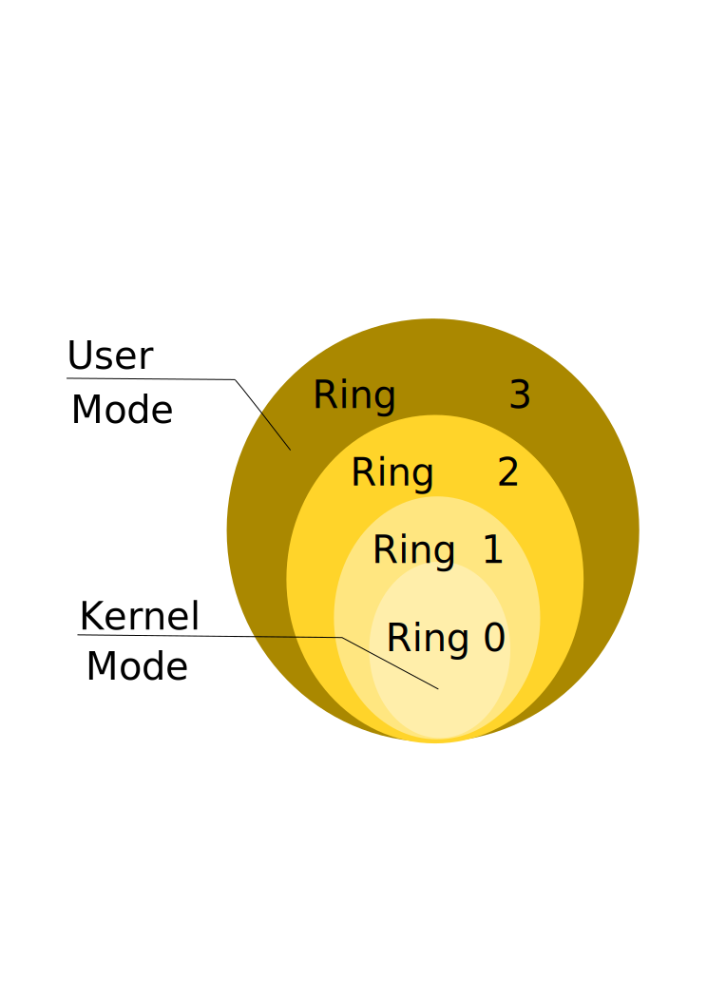

:title: Introduction to Assembly
:data-transition-duration: 1500
:css: asm.css

An introduction to x86 and x86_64

----

Hardware Overview
=================

----

Objectives
==========

* Understand the different privilege modes of operation, and some of their implications
* Understand basic memory segmentation and some descriptor tables
* Understand, at a basic level, virtual memory
* Understand basic processor features, control registers, and how they fit together
* Understand and implement Model Specific Registers  (MSRs)
* Utilize x86(_64) instructions to identify the current processor, and understand how to programmatically query its capabilities

----

Processor Modes
===============

----

User and Kernel modes
=====================

* x86(_64) defines several modes of operation (or "rings") the processor can work in
* Each mode has various instructions (and portions of memory) it is allowed to perform
* User mode (which is least privileged) is Ring 3 (which is where most of your applications reside)
* Kernel mode (most privileged) is Ring 0, which is where the core (or kernel) of the OS resides
* Rings 1 and 2 are (largely) unused by most operatings systems

----

User Mode
=========

* Mode of least privilege (Ring 3)
* Cannot touch more privileged memory sections
* Cannot execute "privileged" instructions
* Typically must task some facility in the kernel in order to get resources

----

Kernel Mode
===========

* Mode of most privilege (Ring 0)
* Can access any portion of memory (and change protection)
* Can perform privileged instructions
* Device drivers often run here (in addition to the core portions of the OS)

----

----

:data-x: r0
:data-y: r2000
:data-rotate-z: 90

Interrupts and Memory Segmentation
==================================

----

:data-x: r0
:data-y: r2000
:data-z: r0

Tables and Memory Segmentation
==============================

* Intel Specifies a number of tables, populated by the OS, which map functionality to the processor.
	+ The Interrupt Descriptor Table, or IDT
	+ The Global Descriptor Table, or GDT
	+ The Local Descriptor Table, or LDT
* Virtual memory also relies on a set of page tables

----

Interrupts and The Interrupt Descriptor Table
=============================================

----

Interrupts
==========

* What are interrupts?
	+ Interrupts provide a special mechanism to alert the kernel of an event
	+ Some (though not all) can be temporarily disabled
	+ Specified via the IDT
* Interrupts can be generated many ways:
	+ Via hardware events (e.g., a keypress on a keyboard)
	+ Page or segmentation faults
	+ Software interrupts also exist
	+ Many others

.. note::

	We won't spend too much time on this particular topic (as it only loosely relates to segmentation), but it is important to understand how interrupts work (at a low level), and this will give you the foundational knowledge needed to understand what's happening under the hood later on.

----

Interrupts (Cont'd)
===================

* Interrupt Service Routines (ISRs)
	+ Functions that respond to interrupts
	+ Set via Interrupt Gates in the IDT (See below)

* Interrupt Gates
	+ Essentially the entry number (in the IDT) of the ISR you want to call
	+ The 'int' assembly instruction will call the corresponding ISR
	+ The 'iret' instruction is provided (on the kernel side) to return back to user mode 

---- 

Interrupts - Example:
=====================

The following code will perform an exit(0) on Linux (x86):

.. code:: nasm
	
	mov eax, 0x01	; the system call number
	mov ebx, 0x00	; first parameter
	int 0x80 		; interrupt

----

:data-x: r0
:data-rotate-y: 90
:data-z: r0

Segment Registers
=================

* Segment registers are a special type of register not covered yet, which come in a variety of flavors
	+ Each of them can be mapped to provide a special "view" of a section of memory
	+ Most modern operating systems use a "flat" memory model, forgoing segmentation (almost) entirely
	+ Still have some real world applications, particularly in Windows

----

Segment Registers
=================

* The Basics:
	+ CS - Code Segment
	+ DS - Data Segment
	+ SS - Stack Segment
	+ FS - Far Segment
	+ GS - Global Segment

* Example: Getting a value from some offset into a segment

.. code:: nasm

	; Retrieves the value stored at offset
	; 0x33 into the Global Segment
	mov rax, [gs:0x33]

----

:data-x: r0
:data-rotate-y: 180
:data-z: r1000

Segmentation - Segments
=======================

* What is a segment?
	+ Describes a logical section of memory
	+ Specifies who can access it (e.g., what privilege level you need)
	+ Indicates the range (start address and length)
* Why are they important?
	+ Part of the segmentation model, used to map a flat section of memory to the segment registers

----

:data-x: r0
:data-y: r2000
:data-z: r0

Segmentation
============

The Global Descriptor Table (GDT)

* Initialized by the operating system
* Contains various segment descriptors in its entries
* The GDT Register (GDTR) indicates where it is located
* Contains information about how the memory in your system gets mapped
* Also (partially) defines how the transition from user to kernel mode occurs
* Intended to be a global structure

----

Segmentation
============

The Local Descriptor Table (LDT)

* Similar to the GDT
* Intended to have smaller scope: e.g., a per-process construct

----

Segmentation - Real World examples
==================================

* Microsoft uses segmentation to provide fast access to key data structures
* The Thread Environment Block (TEB) in user mode
	+ Hangs off of the FS register in x86/GS in x64
	+ Provides lots of important per-thread information
* The Processor Control Block (or KPRCB) in kernel mode
	+ Hangs off of the FS register in x86/GS in x64
	+ Provides lots of important per-processor information

----

Segmentation
============

Further Reading (if interested): 

* The OSDev Wiki describes GDT initialization - http://wiki.osdev.org/GDT_Tutorial
* The Segment Descriptor Cache - Mr. Robert Collins (from a Dr. Dobbs article) - http://www.rcollins.org/ddj/Aug98/Aug98.html

----

Page Tables and Virtual Memory
==============================

// TODO: Implement

----

Processor Security Features
===========================

// TODO: Implement

* DEP
* SMEP/SMAP
* Page Protection

----

Control Registers
=================

// TODO: Implement

----

Model Specific Registers (MSRs)
===============================

* Many of these exist for x86(_64)
* Most only accessible in privileged mode
* used (sometimes) via RDMSR and WRMSR
* Others have special instructions
* Mainly documented by vendor (e.g., Intel manual)

----

Time Stamp Counter
==================

* Can read from user mode (via rdtsc)
* Can only modify from kernel mode
* Low bits of result are stored into EAX/high bits in EDX
	+ This is the same on both x86 and x86_x64
	+ x64 - rdtsc will clear the high bits of storage registers
	+ Results can be combined on x64 to full width with a left-shift and a bitwise or

----

Feature Support
===============

* The CPUID instruction can provide information about the current CPU
	+ Vender string
	+ Model number
	+ Size of internal cache
	+ Various features supported

* The instruction behaves similarly on BOTH x86 and x86_64

* The value in EAX at the time of the CPUID call determines what information comes back
	+ 0 -> Vender ID String - stored in EBX/EDX/ECX
	+ 1 -> Returns a bitfield containing supported features
	+ ...

----

Lab 10
======

MSRs and CPUID

----

Section Review
==============

* Ring 0/3
* Interrupts
* Memory Segmentation
	+ GDT
	+ LDT
* MSRs

