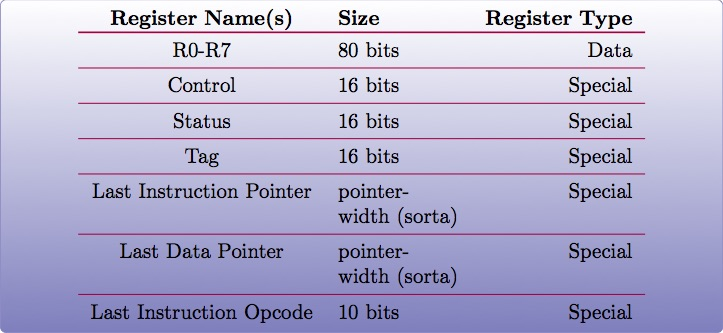
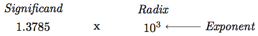
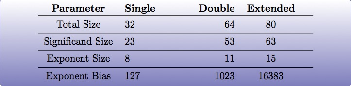

:title: Introduction to Assembly
:data-transition-duration: 1500
:css: asm.css

An introduction to x86 and x86_64

----

Hardware Overview
=================

----

Objectives
==========

* Understand the different privilege modes of operation, and some of their implications
* Understand basic memory segmentation and some descriptor tables
* Understand and implement Model Specific Registers  (MSRs)
* Utilize x86(_64) instructions to identify the current processor, and understand how to programmatically query its capabilities

----

Memory and Tables
=================

An Introduction.

----

User and Kernel modes
=====================

* x86(_64) defines several modes of operation (or "rings") the processor can work in
* Each mode has various instructions (and portions of memory) it is allowed to perform
* User mode (which is least privileged) is Ring 3 (which is where most of your applications reside)
* Kernel mode (most privileged) is Ring 0, which is where the core (or kernel) of the OS resides
* Rings 1 and 2 are (largely) unused by most operatings systems

----

User Mode
=========

* Mode of least privilege (Ring 3)
* Cannot touch more privileged memory sections
* Cannot execute "privileged" instructions
* Typically must task some facility in the kernel in order to get resources

----

Kernel Mode
===========

* Mode of most privilege (Ring 0)
* Can access any portion of memory (and change protection)
* Can perform privileged instructions
* Device drivers often run here (in addition to the core portions of the OS)

----

Tables and Memory Segmentation
==============================

* Segment registers are a special type of register not covered yet, which come in a variety of flavors
	+ Each of them can be mapped to provide a special "view" of a section of memory
	+ Most modern operating systems use a "flat" memory model, forgoing segmentation (almost) entirely
	+ Still have some use cases, particularly in Windows (covered more later)
* Intel Specifies a number of tables, populated by the OS, which map functionality to the processor.
	+ The Interrupt Descriptor Table, or IDT
	+ The Global Descriptor Table, or GDT
	+ The Local Descriptor Table, or LDT

----

Interrupts
==========

The Interrupt Descriptor Table (IDT)

* What are interrupts?
	+ At their core, interrupts provide a special mechanism to alert the kernel of the operating system to some type of event
	+ Interrupts can be everything from hardware events (e.g., a keypress on a keyboard), to page or segmentation faults
	+ Software interrupts also exist, and were previously used as a mechanism to interact with the kernel (more on this later)
* So what does the IDT do?
	+ Initialized to inform the processor of where Interrupt Service Routines (ISRs) are located
	+ ISRs are special routines provided by the operating system, which get called when an interrupt occurs

.. note::

	We won't spend too much time on this particular topic (as it only loosely relates to segmentation), but it is important to understand how interrupts work (at a low level), and this will give you the foundational knowledge needed to understand what's happening under the hood later on.

----

Interrupts (Cont'd)
===================

* Interrupt Gates
	+ Essentially the entry number (in the IDT) of the ISR you want to call
	+ The 'int' assembly instruction will call the corresponding ISR
	+ The 'iret' instruction is provided (on the kernel side) to return back to user mode (more on this later)

* Example: Using a software interrupt in Linux to perform a system call
	+ This is an (old) way of talking to the kernel (x86)
	+ int 0x80 will look up the 0x80-th entry in the IDT, and call it

---- 

Interrupts - Example:
=====================

The following code will perform an exit(0) on Linux (x86):

.. code:: nasm
	
	mov eax, 0x01	; the system call number
	mov ebx, 0x00	; first parameter
	int 0x80 		; interrupt

----

Segment Registers
=================

* The Basics:
	+ CS - Code Segment
	+ DS - Data Segment
	+ SS - Stack Segment
	+ FS - Far Segment
	+ GS - Global Segment

* Example: Getting a value from some offset into a segment

.. code:: nasm

	; Retrieves the value stored at offset
	; 0x33 into the Global Segment
	mov rax, [gs:0x33]

----

Segmentation - Segments
=======================

* What is a segment?
	+ Describes a logical section of memory
	+ Specifies who can access it (e.g., what privilege level you need)
	+ Indicates the range (start address and length)
* Why are they important?
	+ Part of the segmentation model, used to map a flat section of memory to the segment registers

----

Segmentation
============

The Global Descriptor Table (GDT)

* Initialized by the operating system
* Contains various segment descriptors in its entries
* The GDT Register (GDTR) indicates where it is located
* Contains information about how the memory in your system gets mapped
* Also (partially) defines how the transition from user to kernel mode occurs
* Intended to be a global structure

----

Segmentation
============

The Local Descriptor Table (LDT)

* Similar to the GDT
* Intended to have smaller scope: e.g., a per-process construct

----

Segmentation - Real World examples
==================================

* Microsoft uses segmentation to provide fast access to key data structures
* The Thread Environment Block (TEB) in user mode
	+ Hangs off of the FS register in x86/GS in x64
	+ Provides lots of important per-thread information
* The Processor Control Block (or KPRCB) in kernel mode
	+ Hangs off of the FS register in x86/GS in x64
	+ Provides lots of important per-processor information

----

Segmentation
============

Further Reading (if interested): 

* The OSDev Wiki describes GDT initialization - http://wiki.osdev.org/GDT_Tutorial
* The Segment Descriptor Cache - Mr. Robert Collins (from a Dr. Dobbs article) - http://www.rcollins.org/ddj/Aug98/Aug98.html

----

Model Specific Registers (MSRs)
===============================

* Many of these exist for x86(_64)
* Most only accessible in privileged mode
* used (sometimes) via RDMSR and WRMSR
* Others have special instructions
* Mainly documented by vendor (e.g., Intel manual)

----

Time Stamp Counter
==================

* Can read from user mode (via rdtsc)
* Can only modify from kernel mode
* Low bits of result are stored into EAX/high bits in EDX
	+ This is the same on both x86 and x86_x64
	+ x64 - rdtsc will clear the high bits of storage registers
	+ Results can be combined on x64 to full width with a left-shift and a bitwise or

----

Feature Support
===============

* The CPUID instruction can provide information about the current CPU
	+ Vender string
	+ Model number
	+ Size of internal cache
	+ Various features supported

* The instruction behaves similarly on BOTH x86 and x86_64

* The value in EAX at the time of the CPUID call determines what information comes back
	+ 0 -> Vender ID String - stored in EBX/EDX/ECX
	+ 1 -> Returns a bitfield containing supported features
	+ ...

----

Lab 10
======

MSRs and CPUID

----

Floating Point and SIMD
=======================

----

Objectives
==========

* Understand at a basic level how floating point numbers are represented
* Perform basic floating point operations
* Understand and utilize the Single Instruction Multiple Data hardware to perform basic operations

----

x87 - The Floating Point Architecture
=====================================

----

==============
Data Registers
==============

* Can contain any 32 or 64 bit data
* Can't transfer directly from standard registers (e.g., EAX/RAX)

----

GDB
===

Display floating point registers:

.. code:: bash

	(gdb) tui reg float 

----

Floating Point Exceptions
=========================

* Floating point exceptions are separate from typical interrupts
* They are the only interrupts you can disable from an unprivileged operating context
* The previous instruction pointer (and other contextual information) are stored via special registers

----

Floating Point - Additional Information
=======================================

* Floating point hardware also includes its own FLAGS register
* As mentioned in the previous slide, contextual information is stored in special registers under certain circumstances

----

Floating Point Encoding
=======================

* Data encoding is a great deal more complicated for floating point than other types
* Floating point numbers are represented via scientific notation (sort of)
* We can store floats in one of three ways:
	+ Single Precision -> which is 32 bits
	+ Double Precision -> which is 64 bits
	+ Quad Precision -> which is 128 bits

----

Floating Point Encoding (cont'd)
================================

Four parts to the equation:

	+ Significand (also called the mantissa) - This is the decimal representation of our number. A non-zero value will always be in the left-most position
	+ Radix - The base to multiply by (e.g., 10)
	+ Exponent - The power to raise the radix to

----

Floating Point Data Encoding
============================

* x87 Registers Show the split between different parts (under the hood)

So if we have a number like 1378.5, and our hardware looks like this:

We have:

----

Binary Representation
=====================

1. We take the base 2 representation of the number
2. We transform the number, such that it can be represented via scientific notation
3. The exponent is encoded using a "biased" value, which expedites compare operations
4. Since we know that the left-most position of the significand will always be 1, it is dropped for single precision numbers (though it is preserved in doubles).

----

Exponent Values
===============

Bias value added to exponent

e.g., an exponent of 3 (111 in binary) would get added with 127 (in the case of a single precision float), or 1111111, to get 10000110.

----

Special Exponent Values
=======================

* Some values are preserved for special cases in exponent representation
	+ 00000000 (all 0s) - This value is used to encode +/- infinity
	+ 11111111 (all 1s) - This value is used to indicate NaN (Not a Number)

* NaN simply indicates that the floating point encoded value is not valid.

----

Working with Floating Point 
===========================

* The floating point registers are treated like a stack
* Values get pushed on (via "load" instructions) and popped off/copied (via "store" instructions)

----

FPU Instruction Set
===================

Basic Operations

* Loads (push)
	+ fld - Loads a floating point value from the indicated location, onto the stack
	+ flid - Loads an integer value, encoding it as a double, onto the stack

* Stores
	+ fst - Stores the value on the top of the stack at the specified location (either memory or elsewhere in the floating point stack)
	+ fstp - Performs the same operation as above, but also pops the value off the stack.
	+ fist - Converts the value at the top of the stack to an integer, and stores it at the destination.

*  Exchange: fxch - Swaps the contents of the given floating point registers

----

FPU Conditional Move
====================

fcmovcc - Move if: Copies the contents from the requested register in the stack to the top if the condition is satisfied 

* b (e.g., fcmovb) - Move if below (if CF is set to 1)
* nb - Move if not below (e.g., CF is 0)
* e - Move if equal (e.g., ZF is 1)
* ne - Move if not equal (ZF is 0)
* be - Move if below or equal (CF is 1 or ZF is 1)
* nbe - Move if not below or equal (CF is 0 and ZF is 0)

----

FPU Arithmetic Operations
=========================

* fadd/fsub/fmul - Performs the requested operation on the source and destination operands, storing the results in the destination
* fiadd/fisub/fimul - Similar to above, but performs the requested operation on a floating point and integer value

----

Lab 11
======

Floating Point Operations 

----

Single Instruction, Multiple Data (SIMD)
========================================

----

What is SIMD?
=============

* Set of specialized hardware and instructions
* SSE (Streaming SIMD Extensions) is part of this (among others)
* Provide a mechanism for operating on "vectors" of data at a time
* Can perform a variety of operations 128 bits at a time

----

SIMD Hardware
=============

* x86: 8 SSE registers available, from XMM0 - XMM7
* x64: provides 16 SSE registers, from XMM0 - XMM15

----

SIMD Operations - Moving Data
=============================

* Operations typically operate on vector or scalar values
	+ Scalar - 32 bits (single element)
	+ Vector - All elements of the SIMD register (128 bits)

* Moving data in/out:
	+ movups - Move 128 bits of data between memory and/or SIMD register(s), unaligned
	+ movaps - Move 128 bits of data between memory and/or SIMD register(s), aligned
	+ movhps - Move 64 bits into the high part of a SIMD register
	+ movlps - Move 64 bits into the low part of a SIMD register
	+ movss - Move a 32 bit value between memory and/or SIMD register(s)

----

SIMD: Moving Around
===================

.. code:: nasm

	movups xmm0, [rdi]	; moving 128 bits of data into xmm0
	movss xmm1, [rsi]	; moving 32 bits of data into xmm1
	mov [rdx], eax 
	movss xmm2, [rdx]

----

:class: instruction-table

SIMD Arithmetic
===============

The table below lists arithmetic instructions, both the scalar and vector variations:

+-----------+-----------+-----------------------+
| Vector    | Scalar    | Description           |
+-----------+-----------+-----------------------+
| addps     | addss     | Adds operands         |
+-----------+-----------+-----------------------+
| subps     | subss     | Subtracts operands    |
+-----------+-----------+-----------------------+
| mulps     | mulss     | Multiplies operands   |
+-----------+-----------+-----------------------+
| divps     | divss     | Divides operands      |
+-----------+-----------+-----------------------+
 
----

SIMD Arithmetic
===============

Example use:

.. code:: nasm

	movups xmm0, [rdi]	; load first vector
	movups xmm1, [rsi]	; load second vector
	addps xmm0, xmm1 	; add the two
	movups [rdx]		; store the result

----

SIMD Comparisons
================

Comparison Operations

* cmp* operation is a bit strange at first
	+ Compares a combination of registers/memory
	+ Stores the result in the first operand
	+ Third param indicates the type of compare to do (next slide)
	+ Result stored as 0 if the condition is false, -1 (all 1's) if true
* Min and max preserve the values that are greater (or smaller) between operands

----

:class: instruction-table

SIMD Comparisons
================

Cmp's third parameter:

+----------+------------------+----------+
| Number   | Operation        | C Equiv  |
+----------+------------------+----------+
| 0        | Equal            | ==       |
+----------+------------------+----------+
| 1        | Less Than        | <        |
+----------+------------------+----------+
| 2        | Less or equal    | <=       |
+----------+------------------+----------+
| 3        | Unordered        | n/a      |
+----------+------------------+----------+
| 4        | Not Equal        | !=       |
+----------+------------------+----------+
| 5        | Not Less than    | !(x < y) |
+----------+------------------+----------+
| 6        | Not less or equal| !(x <= y)|
+----------+------------------+----------+
| 7        | Ordered          | n/a      |
+----------+------------------+----------+

----

:class: instruction-table

SIMD Comparisons
================

Operations

+-----------+-----------+-------------------------------+
| Vector    | Scalar    | Description                   |
+-----------+-----------+-------------------------------+
| maxps     | maxss     | Obtains maximum of operands   |
+-----------+-----------+-------------------------------+
| minps     | minss     | Obtains minimum of operands   |
+-----------+-----------+-------------------------------+
| cmpps     | cmpss     | Compares operands, all 1's or |
|           |           | 0's returned.                 |
+-----------+-----------+-------------------------------+

----

SIMD Comparisons
================

Example:

.. code:: nasm

	movups xmm0, [rax]
	movups xmm1, [rcx]
	cmpps xmm0, xmm1, 4	; find the values that are not equal

----

:class: instruction-table

SIMD Bitwise Operations
=======================

+-----------+---------------------------+
| Vector    | Description               |
+-----------+---------------------------+
| andps     | Bitwise and of operands   |
+-----------+---------------------------+
| orps      | Bitwise or of operands    |
+-----------+---------------------------+
| xorps     | Bitwise xor of operands   |
+-----------+---------------------------+

----

GDB
===

Display SIMD registers:

.. code:: bash

	(gdb) tui reg vector 

----

Lab 12
======

SIMD