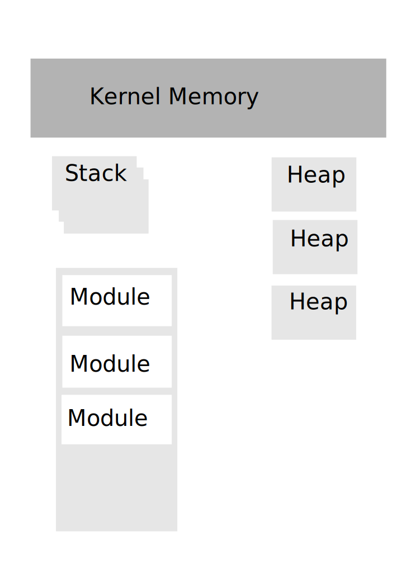
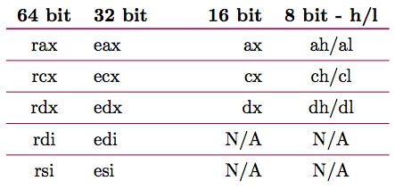
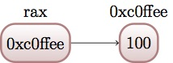
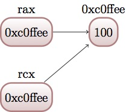
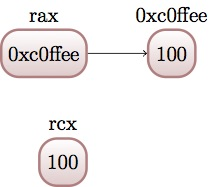

:title: Introduction to Assembly
:data-transition-duration: 1500
:css: asm.css

An introduction to x86 and x86_64

----

Introduction to Assembly Programming
====================================

.. code:: nasm

	instructor	db "Aaron Bray", 0x0a, 0x00
	email  db "aaron.m.bray@gmail.com", 0x0a, 0x00

----

Course Roadmap
==============

.. code:: nasm

	content:
		jmp .introduction

	.introduction:
		mov rax, HowToAsm
		jmp .basic_operations

	.basic_operations:
		call .arithmetic
		call .bit_operations
		mov rcx, DataTypes
		jmp .control_flow

	.control_flow:
		jmp .hardware_essentials

	.hardware_essentials:
		mov rax, Memory
		mov rcx, Interrupts
		call FloatingPoint
		call Simd
		call .systems_programming

	.systems_programming:
		ret

----

Assembly: An Introduction
=========================

----

Objectives
==========

* Understand the relationship between assembly language and opcodes
* Understand byte ordering, as it pertains to Assembly Programming
* Identify x86(_64) General Purpose Registers
* Perform basic memory access operations
* Begin debugging with the GNU Source-Level Debugger (GDB)
* Understand basic data sizes and types with regard to x86(_64)

----

Understanding Assembly
======================

* What is Assembly?
	+ Provides "instructions" (human-friendly) that map to "opcodes" (processor-friendly)
	+ Typically very hardware-specific
* Why use assembly?
	+ Performance
	+ Utilize otherwise unexposed hardware features
	+ Some operations can't easily be expressed in higher level languages (such as C)

.. note::
 
	Performance is now much less often a reason to use assembly than it was in the past (as compilers have steadily improved, and more features exposed via intrinsics).

----

Assembly Instructions
=====================

* Typically consist of an instruction of some kind, and some operands
* Operands can consist of several things, to include:
	+ Registers 
	+ Memory Addresses
	+ Immediate (literal) Values
* Other data types and some prefixes (which modify what the instruction does) also exist

----

Opcodes
=======

* One or more bytes that the processor decodes (and executes)
* Typically direct translations from assembly language instructions
* x86 and x86_64 instructions are variable length
* Syntax is (slightly) complicated

----

:data-rotate: 90

Assembly Instructions
=====================

This set of instructions:

:class: code-border

.. code:: nasm

	mov eax, 0x01
	ret

Becomes...

.. note::
	
	Thus, this set of instructions becomes the follow set of opcodes.

----

:data-x: r0
:data-y: r0
:data-rotate-y: 90

Opcodes
=======

\...This set of opcodes

.. code:: objdump-nasm

	0xb8 0x01 0x00 0x00 0x00
	0xc3

.. note::

	Perform opcodes demo

----

:data-x: r0
:data-y: r2000
:data-rotate-y: 0

Assemblers and Syntax
=====================

* A number of different options exist for assemblers
	+ GAS - the GNU Assembler
	+ nasm/yasm - The Netwide Assembler/Yet another Assembler (a rewrite of NASM)
	+ masm - the Microsoft assembler
* Most have special quirks and slight differences in how syntax is handled (though they are similar)
* This course will focus on NASM, which uses Intel syntax

----

Syntax Differences - Some Examples
==================================

* Intel Syntax: Used by NASM/YASM and others

.. code:: nasm

	mov eax, 0x01

* AT&T Syntax: Used by GAS and others

.. code:: gas

	movl $0x01, %eax

* Other flavors also exist

.. note::

	This is one very blatant example, but many other assemblers (MASM, etc) will have small quirks to how you type in your assembly instructions. All equate to (about) the same thing, however.

----

:data-y: r2000

Byte Ordering 
=============

* Determines the order bytes appear in memory
* Big Endian stores the most significant (or biggest) value first 
	+ the memory address: 0x10203040 would appear as: 0x10 0x20 0x30 0x40
* Little Endian puts the least significant (or little) value first 
	+ the memory address: 0x10203040 would appear as: 0x40 0x30 0x20 0x10

----

Byte Ordering
=============

* x86(_64) is little Endian
* Again, least significant byte (not bit) appears first

In memory, this address:

.. code::

	0xdeadbeef

----

:data-x: r0
:data-y: r0
:data-rotate-y: 90

Byte Ordering
=============

Becomes:

.. code::

	0xefbeadde

----

:data-y: r2000

:class: split-table

Byte Ordering
=============

+----------+-----+------+------+-----+
| Initial: | 0xde| 0xad | 0xbe | 0xef|
+----------+-----+------+------+-----+
| Memory:  | 0xef| 0xbe | 0xad | 0xde|
+----------+-----+------+------+-----+

----

Memory: The 10,000 Foot View
============================

* Various Memory Components take differing amounts of time to access
* Most higher level languages (such as C) abstract this away, the developer is not really exposed to it
* Assembly gives you a bit more control (though some things are still hidden on most modern platforms)

----

The Memory Hierarchy
====================

From Fastest Access to Slowest:

* Registers
* Cache (L1/L2/L3)
* System Memory
* Disk

----

Virtual Memory
==============

* Hardware allows abstraction of memory addressing
* Most addressing deals with virtual addresses, which are translated (via lookup table) to physical addresses
* More than one "view" of a physical memory segment can exist (in different processes)
* Each user mode process appears to have a full range of addressable memory and resources
* Most modern OSes support paging, allowing us to pretend we have a much greater amount of physical memory than actually exists

.. note::

	We will discuss virtual memory and memory mappings in general later on, when we discuss specific hardware features

----

:class: shrink-image block-image

Process Memory Layout
=====================

A Very High level view:

----

Process Memory Layout
=====================

* Stack Segments typically grown from high to low memory addresses
* Modules in the previous diagram indicate executable files loaded into the process space; some examples include:
	+ glibc (more specifically, the .so containing the libc code)
	+ kernel32.dll
	+ Currently running executable
* Heap sections and Anonymous Mappings
* Kernel memory
* Other Items

----

Registers
=========

* Assembly programming gives us total control over access to these
* Special hardware structures on the processor
* Some are general purpose (e.g., can store any type of data)
* Others are specialized, and may contain status codes, flags, etc., or be associated with specific hardware 
* Limited in number

----

General Purpose Registers
=========================

* Shared registers have addressable subregisters
* 64 bit/32 bit/16 bit/8 bit
* x86_64 contains many more general purpose registers than x86
  (though they don't all have subregisters)

----

:data-rotate-x: 90

:class: register-table

x86 and x64 Registers
=====================

* rbp/ebp - Base Pointer
* rsp/esp - Stack Pointer

.. note::

	Being general purpose, most of the registers may be
	used to store arbitrary values, though some may have defined
	uses with certain instructions (which we'll discuss later on).
	The registers listed at the bottom generally have some special uses
	however, where RIP/EIP points at the current place in memory we are executing, and RSP/ESP typically points to the top of the stack (which will also be discussed in greater detail later on).

----

Registers (cont'd)
==================

* rip/eip - Instruction Pointer (Program Counter)
* Additional x86_64 Registers: r8 - r15

----

:data-x: r2000

Register Data and Pointers
==========================

* General Purpose Registers can contain up to pointer-sized amounts of data (4 bytes on 32 bit, 8 on 64)
* They can also contain memory addresses (pointers) to blocks of data residing elsewhere in the process.
* Addresses can be manipulated via addition, subtraction, multiplication, etc
* Square brackets dereference (access the stuff stored AT the memory address)

Example:

.. code:: nasm

	; A register - we will be operating on whatever 
	; happens to be stored in it
	rax 
	; We are attempting to access the stuff stored 
	; at the address in rax (dereference)
	[rax] 

----

Register Data and Pointers - Example
====================================

First, we'll store a pointer (memory address) in rax, and then store some stuff there:
--------------------------------------------------------------------------------------

.. code:: nasm

	mov rax, 0xc0ffee ; a memory address (hopefully valid!)
	mov [rax], 100 ; now we store some data there!

----

Register Data and Pointers - Example (Part 2)
==============================================

Now, we'll copy that address into rcx:
--------------------------------------

.. code:: nasm

	mov rcx, rax ; now we copy the pointer!

* Now both point to the same place!

----

Register Data and Pointers - Example (Part 3)
=============================================

Now, we'll access the data stored at the address, and copy it into rcx 
----------------------------------------------------------------------

.. code:: nasm
	
	mov rcx, [rcx] ; copy the data from addr 0xc0ffee into rcx

Please note that this replaces the old value in rcx, which was just the address we're accessing.

----

Now, for our first instruction...
=================================

----

NOP
===

* Does nothing! (Sort of)
* Used for padding/alignment/timing reasons
* Idempotent instruction (doesn't affect anything else in the system)
* One-byte NOP translates to the opcode: 0x90

----

Debugging Assembly
==================

* We will be using the GNU Project Debugger (GDB)
* Command Line Debugger, provides a large set of features
	+ Natively supports Python scripting
	+ Supports a large number of architectures (and even quite a few languages)
	+ Provides a Text User Interface (TUI) mode

----

Debugging Assembly (cont'd)
===========================

* Setting breakpoints programmatically may be difficult at times
* A good strategy may include applying breakpoints directly in your code for debugging purposes
* Fortunately, an assembly instruction exists for doing just this:

.. code:: nasm

	int3 ; NOTE: no space between int and 3

Which translates to the following opcode:

.. code:: objdump-nasm

	0xcc

.. note::

  Tips for debugging assembly: keep an eye on registers, use breakpoints liberally!

----

Debugging With GDB
==================

Preconfiguration:

* .gdbinit provides a way to run a number of setup commands on launch
* Simply copy the config file to your home directory:

.. code:: bash

	~/Desktop/handouts $ cp sample-gdbinit ~/.gdbinit

Launching a program with GDB:

.. code:: bash

	~/Desktop/Lab1 $ gdb lab1
	(gdb) run
	...
	(gdb) quit

----

GDB
===

* Basic Use: Generally useful commands
	+  info - Displays information (in general, or about specific commands)
	+  help - Can provide context-specific help; e.g., listing available commands/options

* refresh:  will redraw the console window

----

GDB
===

* Single Stepping (step/s)
	+ Can also use stepi
* Stepping Over (next/n)
	+ Can also use nexti

----

GDB
===

* Breakpoints (break)
	+ Allows us to programmatically set breakpoints without modifying application source code
* info break - shows us information about all currently set breakpoints
* Removing breakpoints (clear and delete)

Example:

.. code:: bash

	(gdb) break myfunc
	Breakpoint 1 at 0x4004a4
	(gdb) info break
	Num 	Type 		 Disp Enb Address
	1		breakpoint   keep y   0x00000000004004a4
	(gdb) delete 1
	(gdb) info break
	No breakpoints or watchpoints

.. note:: 

	Demo stepping and using GDB with a sample init file and our opcodes demo

----

Memory Access Instructions
==========================

* We'll begin looking at instructions to copy and access data from various locations in memory
* Additionally, we will begin examining address calculation

----

Memory Access - mov
===================

Description
-----------

Moves a small block of memory from a source (the right-hand operand) to destination (the left operand). An amount of data may be specified (more on this later).

Basic Use
---------

.. code:: nasm

	mov rax, 0x01      ; immediate - rax is now 1
	mov rax, rcx       ; register - rax now has a copy of ecx
	mov rax, [rbx]     ; memory - rbx is treated as a pointer
    mov rax, qword [rbx + 8] ; copying a quad word (8 bytes)

.. note::

	The mov instruction simply copies data from source (the operand on the right), to destination (the operand on the left).

----

Memory Access - lea
===================

Description
-----------

Calculates an address, but does not actually attempt to access it.

Basic Use
---------

.. code:: nasm

    ; calculate an address by taking the address
    ; of what RDX points at,
    ; and adding 8 bytes to it (perhaps indexing
    ; into an array). Note that we are just calc-
    ; ulating the address, NOT accessing memory.
	lea rax, [rdx + 8]
	mov rax, [rax]     ; actually accessing the memory

----

:data-y: r2000

Memory Access - xchg
====================

Description
-----------

Exchanges the values provided atomically (more on this later).

Basic Use
---------

.. code:: nasm

	xchg rax, rcx   ; exchange two register values
	; exchange a register value with a value stored in memory
	xchg rax, [rcx] 

----

:data-rotate-y: 180

Lab 1
=====

Memory Access

* Copy the Lab1 folder (and its contents)
* Modify the \*.nasm file (Each function should have a comment block - lines starting with ';' containing instructions)
* Build and run using the following commands:

.. code:: bash

	~/Desktop/Lab1 $ cmake . && cmake --build .
	~/Desktop/Lab1 $ ./lab1

----

Assembly and Data Types
=======================

* Slightly different concept than in higher level languages
	+ Typically just bytes in a buffer
	+ Data 'type' is really just interpretation
	+ Generally differentiated by sizes, alignment, and certain bits being set
* Some operations will preserve special properties in a given data set (such as sign, e.g., +/-)
* Other operations may expect different alignments in the data they work on, or may have issues with certain values (such as floating point)

----

x86(_64) general data sizes
===========================

* byte - "smallest" addressable unit
* word - two bytes
* dword - double word (4 bytes - pointer width on x86)
* qword - quad word (8 bytes - pointer width on x64)

----

GDB: Examining Memory
=====================

* We can use GDB to examing various places in memory with "x" (for "eXamine")
* x has several options:
	+ x/nfu - where n is the Number of things to examine, f is the Format, and u is the Unit size 
	+ x addr
	+ x $<register> - examines the memory address pointed to by the register

----

GDB Formatting
==============

* The "f" in x/nfu
* Format options include:
	+ s - For a NULL-terminated string
	+ i - For a machine instruction
	+ x - For hexidecimal (the default, which changes when x is used)

* Example: Disassembling at RIP

.. code:: bash

	(gdb) x/i $rip

----

GDB Unit Sizes
==============

* The "u" in x/nfu
* Unit size options are a bit confusing in the context of x86(_64) assembly, and include:
	+ b - bytes
	+ h - Halfwords (equivalent to "word" in x86(_64) asm; e.g., 2 bytes)
	+ w - Words (4 bytes, equivalent to dwords)
	+ g - Giant words (8 bytes, equivalent to qwords)

.. note::

	Demo - Dumping memory via GDB

----

Sub Registers
=============

* Subregisters are still part of the bigger "parent" register
* Unless special instructions (not yet mentioned) are used, will NOT modify data in the other portions of the register.

----

Memory/Register Access - mov
============================

* When accessing memory, amount of data to copy can be specified

.. code:: nasm

	mov al, byte [rsi] ; copy a single byte
	mov eax, dword [rcx] ; copy a dword (4 bytes)
	mov rax, qword [rsi] ; copy a qword (8 bytes)

* Also, data can be copied from subregister to subregister

.. code:: nasm

	mov al, cl  ; copy from cl to al
	xchg al, ah ; exchange the low and high bytes in ax

----

Register Access - movzx
=======================

Description
-----------

Move with zero extend. When moving data that is smaller than the destination size,
zero out the remaining bits.

Basic Use
---------

.. code:: nasm

	movzx rax, cl ; everything above al is now set to 0
	movzx rax, byte [rsi + 5]

----

Lab 2
=====

Using subregisters, accessing smaller values, and zero extending.

* Copy the Lab2 folder (and its contents)
* Modify the \*.nasm file (Each function should have a comment block - lines starting with ';' containing instructions)
* Build and run using the following commands:

.. code:: bash

	~/Desktop/Lab2 $ cmake . && cmake --build .
	~/Desktop/Lab2 $ ./lab2

----

Structures
==========

* NASM provides a data structure concept for convenience in handling complex data types
* More of a macro than something truly representative of C-style structs
* Very useful for keeping track of local variables or parameters (among other things)

----

Structures
==========

.. code:: nasm

	struc MyStruct
		.field1		resd 1	; field1's size is 1 dword
		.field2		resd 1  ; field2's size is 1 dword
		.field3		resq 1	; field3's size is 1 qword
	endstruc

	; ...
	; This will be equivalent to: mov rax, [rdi+8]
	mov rax, [rdi + MyStruct.field3] 

----

Section Review
==============

* Byte Ordering
* Process Layout
* Registers
	+ Stack Pointer
	+ Base Pointer
	+ Instruction Pointer
* Dereferencing Pointers via Register
* Sub registers